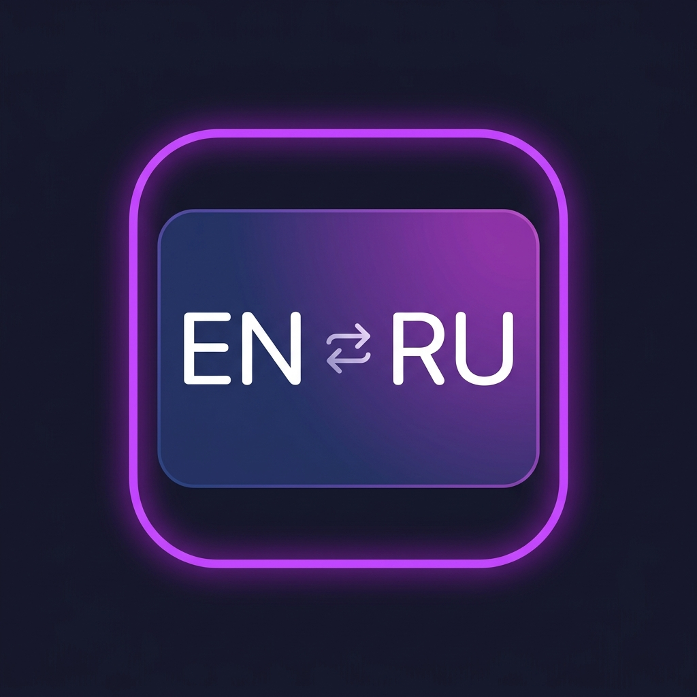
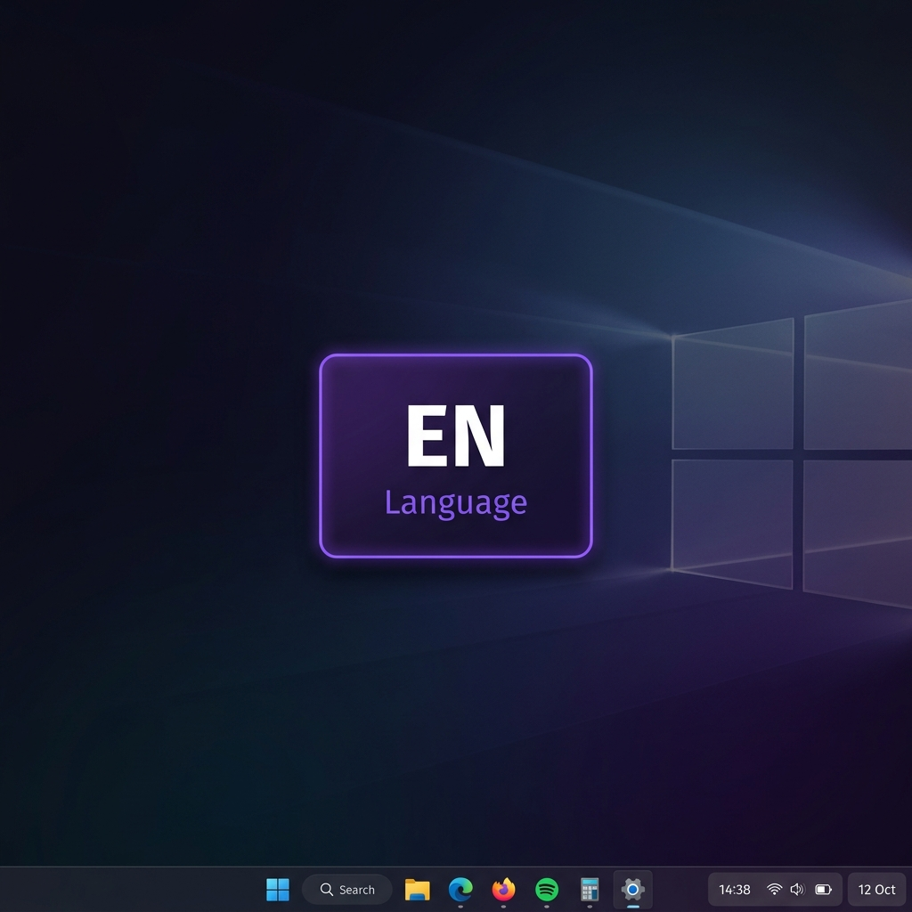

<div align="center">



# LangSwitch

**KDE Plasma–style language switcher OSD for Windows**

[](https://github.com/stormsia/LangSwitch/releases)
[](LICENSE)
[](https://github.com/stormsia/LangSwitch/releases)
[](https://www.rust-lang.org/)

*Switch keyboard layouts with a beautiful, non-intrusive OSD — just like KDE Plasma on Linux, but for Windows.*



</div>

---

## ✨ Features

- 🪟 **KDE Plasma–inspired OSD** — elegant floating indicator appears on layout switch, then fades out automatically
- ⌨️ **Custom Hotkey Support** — adds `Ctrl+Shift` as a fast and convenient global shortcut for switching languages
- 🎨 **Follows your system theme** — adapts to Windows light/dark mode and accent color
- 🖱️ **Fully click-through** — the overlay never steals focus or blocks interaction
- 📌 **Tray icon** — lives quietly in the system tray; right-click to toggle or quit
- ⚡ **Minimal footprint** — written in Rust, ~2 MB binary, near-zero CPU/RAM usage
- 🔕 **No taskbar clutter** — OSD window is completely invisible outside of active display

## 📸 Preview

The OSD popup appears near your cursor for ~1.8 seconds when you press `Ctrl+Shift` (or standard Windows shortcuts), then smoothly fades out:

## 📸 Preview

The OSD popup appears near your cursor for ~1.8 seconds when you press `Ctrl+Shift` (or standard Windows shortcuts), then smoothly fades out:


## 🚀 Installation

### Option 0 — Via WinGet (recommended)

```cmd
winget install stormsia.LangSwitch
```
### Option 1 — Download Installer (Recommended)
1. Go to [**Releases**](https://github.com/stormsia/LangSwitch/releases)
2. Download & run `langswitch-*.msi` from the latest release
3. It will install LangSwitch to C:\Program Files\LangSwitch, add a Start Menu shortcut, and automatically configure it to run on Windows startup.

### Option 2 — Download release binary 

1. Go to [**Releases**](https://github.com/stormsia/LangSwitch/releases)
2. Download `langswitch.exe` from the latest release
3. Run it — the tray icon will appear immediately

> **Autostart**: Place a shortcut in `shell:startup` (`Win+R` → type `shell:startup`) to launch on login.

### Option 3 — Build from source

**Requirements:** [Rust toolchain](https://rustup.rs/) (stable), Windows 10/11

```bash
git clone [https://github.com/stormsia/LangSwitch.git](https://github.com/stormsia/LangSwitch.git)
cd LangSwitch
cargo build --release
# Binary: target/release/langswitch.exe

```

## 🖱️ Usage

| Action | Result |
| --- | --- |
| Press `Ctrl + Shift` | Switches the language and shows OSD |
| Press standard Windows hotkey | OSD appears with new language, fades in 1.8s |
| Right-click tray icon → **Intercept keys** | Toggle key interception on/off |
| Right-click tray icon → **Quit** | Exit LangSwitch |

> LangSwitch provides a built-in `Ctrl+Shift` shortcut, but it also works with whatever hotkey Windows uses for layout switching (e.g., `Alt+Shift` or `Win+Space`).

## ⚙️ How it works

1. A **global keyboard hook** intercepts layout-switch key combos (including the built-in `Ctrl+Shift` shortcut)
2. `ActivateKeyboardLayout` switches the active layout
3. A **Slint OSD window** with `WS_EX_TOOLWINDOW | WS_EX_TRANSPARENT | WS_EX_TOPMOST` displays the new layout abbreviation near the cursor
4. The window fades out via opacity animation, then is hidden via Win32 — leaving no trace

## 🏗️ Tech stack

| Component | Technology |
| --- | --- |
| Language | [Rust](https://www.rust-lang.org/) |
| UI / OSD | [Slint](https://slint.dev/) |
| Win32 API | [windows-rs](https://github.com/microsoft/windows-rs) |
| Tray icon | [tray-icon](https://github.com/tauri-apps/tray-icon) |
| Concurrency | [crossbeam-channel](https://github.com/crossbeam-rs/crossbeam) |

## 📋 Requirements

* Windows 10 or Windows 11 (x64)
* No runtime dependencies — fully static binary

## 🤝 Contributing

Issues and PRs are welcome! If you have ideas for features (multi-monitor improvements, config file, more OSD styles), open an issue to discuss.

## 📄 License

MIT © 2026 [stormsia](https://www.google.com/search?q=https://github.com/stormsia)
